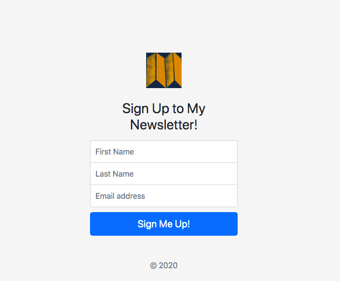
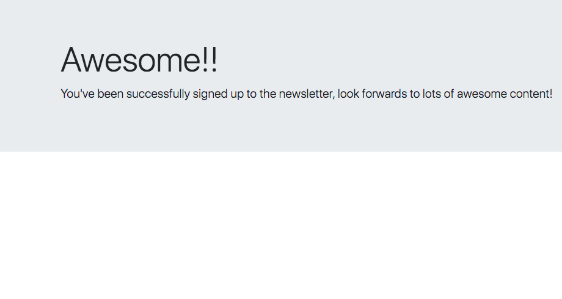
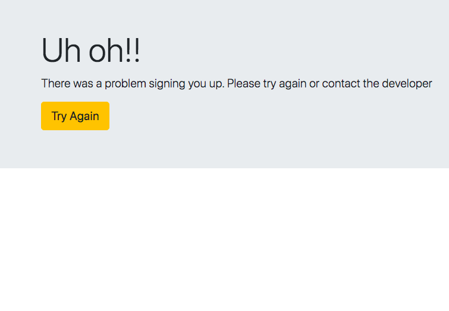

# **Newsletter Sign up page connected to the mailchimp API**
#### If you are somebody who wants to set up your own newsletter, where you want to mail people who are interested in hearing from you, then you need a sign up page.
#### This is a single page website in the front end  but in the backend it has some powerful functionalities that Will allow you to sign people up to your mailing list through the Mailchimp API.

#### Once you click sign up, if it was successful then we get the success page,

#### and if it wasn’t  then we Will get a failure page to try again.

